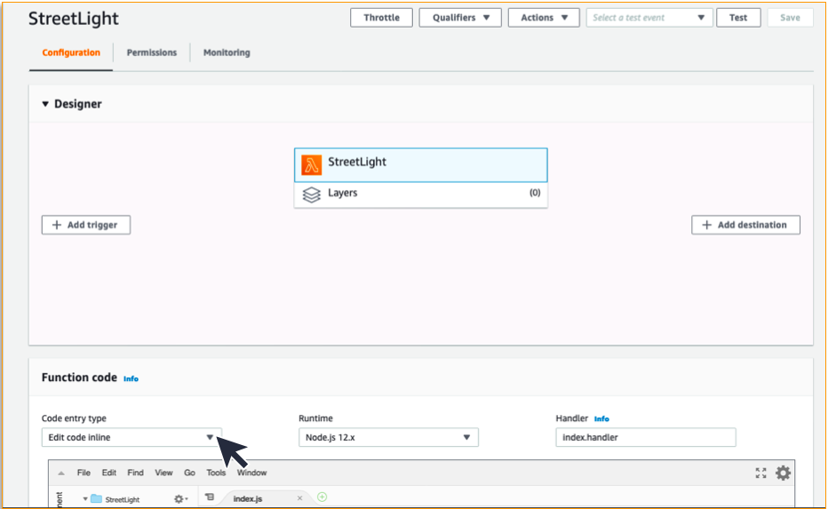
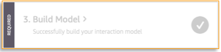

This walkthrough is based on several contributors, not least of which is [Implement a Connected Building with Alexa and AWS IoT](https://aws.amazon.com/blogs/iot/implement-a-connected-building-with-alexa-and-aws-iot/) from the AWS Blogs.
# Alexa Voice Service and AWS IoT

# 1	AWS IoT
In this lab, we will create a voice-activated street light simulation.  The user will be able to send a command through a virtual Echo device to control a device representing a street light.
## 1.1	Creating a ‘thing’ to represent a physical device
We will start by logging into the AWS Console and logging in . Once logged in, please verify that the selected region is "**N. Virginia**" or "**US East (N. Virginia) us-east-1**" in the top right-hand corner of the console, as shown below.


Under "Find Service", type "IoT Device Management", as shown below.


You should be presented with the window below: 


Select the "Register a thing" button.  On the following screen, select "Create a single thing" as shown below:


Then we will give our device a unique name ("**StreetLight**") to identify this specific device.  *Note: if we intended to control hundreds of street lights we would likely choose something similar to "StreetLight-0001" or "StreetLightMileMarker330" or similar, but ours is the simple case of a single light.* We then create a type to identify street lights in contrast to other devices we may later choose to control (perhaps traffic lights, railroad crossing gates, or school zone flashing signage?) by selecting "**Create a type.**"


In the following form, give you type a name ("**StreetLightType**") and a description of your choosing:


and select "Create thing type" to be taken back to the "*Add your device to the thing registry*" window.


Scroll to the bottom of "*Add your device to the thing registry*", and select "**Next**".


We now need to create a method for securely commanding our device (we do not want just anyone to be able to switch streetlights on and off!), and to that end we need to create a certificate for our StreetLight thing.  On the next scree, "*Add a certificate for your thing*", select "**Create certificate**."


At the next window you will have the opportunity to download your certificate as well as your public and private keys; please download all three.  Then select "**Done**".


Congratulations!  You have now created your first AWS IoT Thing!

## 1.2	Interacting with your "thing" via "Device Shadows"
With AWS IoT you can create a persistent, virtual version, or ‘shadow state’ of each device that includes the device’s latest state. This allows applications or other devices to read messages and interact with that device. Device Shadows persist the last reported state and desired future state of each device, even when the device is offline. Alternatively, you can retrieve the last reported state of a device or set a desired future state through the AWS IoT API. AWS IoT will compare the desired and last reported state, and command the device to make up the difference.

Device Shadows make it easier to build applications that interact with your devices by providing always available REST APIs.

The [AWS IoT Device SDK](http://docs.aws.amazon.com/iot/latest/developerguide/iot-device-sdk.html) makes it easy for your device to synchronize its state with its shadow, and to respond to desired future states set via the shadow. You do not need it for this tutorial as we will not focus on the code that would be located on the physical device. If you have a physical device you wish to connect you can follow [these instructions](http://docs.aws.amazon.com/iot/latest/developerguide/iot-sdks.html).

Now, we have a thing called ‘StreetLight’ and it has a shadow. We are going to use them to change the state of our street light. The street light can either be on or off.

We will focus on how to change the Shadow state of a device using an Alexa skill. To make things easy we are going to simulate having connected a physical object with the AWS IoT Device SDK and the state of our device.

Go back to the AWS Console as we left it and click on your *thing*, "StreetLight":


This will bring you to the details screen for "StreetLight". Select "**Shadow**" from the left-hand menu:


You are now on the shadow screen for "StreetLight", where you can see the reported state of your thing and metadata.  Click the "**Edit**" button in the top-right of "*Shadow Document*":


This allows us to update the *shadow* state of your *thing*.  Enter the following into the "**Shadow state**" field.  Again, please note that the contents of the desired and reported JSON objects can and should be customized to match the state of your IoT device.  Since this is a street light, using a field named ‘light’ makes sense:

```json
{
    "desired": {},
    "reported": {"light":0}
}
```

Then click the "**Save**" in the top-right corner above "*Shadow state*".  It should now read:

```json 
{
    "reported": {
      "light" : 0
    }
}
```

This step simulates having a physical device connected to AWS IoT. If we had a physical device with a street light, it would have published the same state thanks to the [AWS IoT Device SDK](http://docs.aws.amazon.com/iot/latest/developerguide/iot-device-sdk.html) and we would have the exact same information in our Shadow state. The ‘reported’ section is meant to be updated by the physical device only. We are showing you how to do it, in case you don’t have a physical device to connect.

To control a physical device, you need to update the ‘desired’ part of the Shadow state using the AWS IoT API. In our case we will use our Alexa skill to update the ‘desired’ section of the Shadow state using the AWS IoT API from AWS Lambda.

## 1.3	Create an AWS Lambda function that will be used by our Alexa Skill to interact with our IoT Device Shadow
We will now create and configure an AWS Lambda function to allow our Alexa Skill to interact with our IoT device for modifying and querying its state.  At the top of the page, click on the "Services" drop-down menu and type "Lambda" in the search field.  Then hit enter.  This will take you to the Lambda section of the AWS console:


Now, click the "**Create function**" button:


Leave the "**Author from scratch**" default selected and fill in the "*Basic information*" section fill in a "*Function name*".  Set the "*Runtime*" to "**Node.js 12.x**" and then click on the "**Create function**" button:


Scroll down to the "*Function code*" section of the page and click on the "**Code entry type**" dropdown menu.  Choose the "**Upload a file from Amazon S3**" option.



In the "*Amazon S3 link URL field*", enter the following: 
	https://iot-alexa-workshop.s3.amazonaws.com/lambda.zip 
  
In the "Handler" field, change the value from "**index.handler**" to "**index.controlStreetLight**".

Your "*Function code*" section should look as below. Then click the "**Save**" button in the top right corner of the page.


*If you get an error regarding the region of the bucket where the code is stored, verify that you are in the N. Virginia region in the top-right corner of the console. Also, the code that gets loaded into your Lambda function is for the street light example we’ve been using throughout the course of this workshop.  If you have customized the IoT device to match your targeted device, you will likely need to modify and extend this function to suit your needs.*

There are three config parameters at the top of "*index.js*" file that we will need to update in order for our Lambda function to work properly.  Those can be seen here, from the "*Function code section*":


We need to grab those from the IoT Thing page.  Open a new tab/window in your browser by clicking [here](https://console.aws.amazon.com/iot/home).  Be sure to leave the Lambda console open.  In the new window, click on "**Manage**", then click on your thing:


Next, click "*Interact*" from the left-side menu:


Which will show HTTPS and MQTT interaction endpoints.  We are interested in the HTTPS Rest API Endpoint, which we will copy (your endpoint name will differ from what is shown)...


...into our Lambda function in the other tab.  Paste the value into the value (quotes) for **config.IOT_BROKER_ENDPOINT** as shown (again, your endpoint name will be different):


Next, update  **config.IOT_BROKER_REGION** to the region you are operating in (which should be "**us-east-1**" if you have followed the lab closely).  *Hint: You can see the region name in the URL of the Rest API Endpoint.*  We also need to change the **config.IOT_THING_NAME** variable to the name of our thing, "**StreetLight**".  Your updated variables should look similar to below (your endpoint will be different).


When complete, select the "**Save**" button in the corner.


We need to give our Lambda function permission to call the AWS IoT APIs in order to make updates and query the current state.  To do this, we scroll up to the top of the screen and click on the "*Permissions*" tab.


On the "*Permissions*" tab, we will click on the "**Manage these permissions**" link within the text of the "*Resource summary*" section.


You will be taken to the IAM permissions associated with the role created for your Lambda function.  Click the "**Attach Policies**" button to add a policy to allow your Lambda function to work with IoT devices.


In the search box on the resulting page, type in "**iotfull**" which should narrow the options.  Check the box next to the "*AWSIoTFullAccess*" policy, and then click the "**Attach Policy**" button.


You can now close the tab/window for IAM and return to the window with your Lambda function in it.

Scroll to the top of the screen to where you can see your Lambda functions ARN and copy/paste it to a notepad as we will need it in the next section that deals with building you Alexa Skill.  *Hint: You can just click the icon to the right of the ARN to copy it to your clipboard (your ARN value will be different than what is shown below).*


# 2	Alexa Skills Kit
## 2.1	Creating an Alexa Skill to invoke our AWS Lambda function
We will now utilize the Alexa Skills Kit to build an Alexa Skill that will leverage AWS Lambda to control and query the state of our street light.  We begin with the Alexa Skills Kit [console](https://developer.amazon.com/en-US/alexa/alexa-skills-kit/start).  *Hopefully, you already have an account, in which case you can click the "**Sign in here**" link at the top of the page.  If you do not have an account, click the "**Sign Up**" link to create one.*  Once you are logged in, we will start by clicking the "**Create Skill**" button.


Enter a Skill name and leave the defaults selected in sections "*1. Choose a model to add to your skill*" ("**Custom**" should be selected), and "*2. Choose a method to host your skill’s backend resources*" ("**Provision your own**" should be selected).


Then click "**Create Skill**" in the top-right corner of the screen.


On the "*Choose a template*" page, leave the default value of "**Start from scratch**" selected and click the "**Choose**" button:


We should now be on the main page for our skill.  Notice on the right-hand side there is a "*Skill builder checklist*". We will be working to complete that checklist throughout the rest of this section.
  
First, we need to create some intents.  An *intent* represents an action that fulfills a user's spoken request. Intents can optionally have arguments called *slots*.  To create our first intent: on the left-hand side of the console (to the right of the "Intents" section), click on the plus sign (+) next to the word "**Add**".


This brings us to the *intent* creation screen.  We are going to create a custom *intent*, but feel free to take a look at the built-in intents on this screen so that you know what types of intents have already been built and can be used by your skills.  In this case, we are going to name our intent "**turnOn**". 

Fill in the name for the intent and click the "**Create custom intent**" button.


We need to provide some "*Sample Utterances*" for our intent.  *Sample utterances* are a set of likely spoken phrases to be mapped to the intents. This should include as many representative phrases as possible.  Enter as many as you can think of (followed either by the "return" or enter key on your keyboard, or by clicking the plus symbol (+).  Below, three utterances are provided.


You can now click on the "*CUSTOM*" menu selection at the top of the left side of the screen and see that you have completed the second step on the Skill builder checklist.


We will add two more intents to the skill: one named "**turnOff**", and another named "**getStatus**".  These will ultimately be used to turn the street light off and to get the state of the street light (on or off).  The number of intents you will need will vary based on the type of device and the features you will support.  Repeat the process for "**turnOn**" for the additional intents "**turnOff**" and "**getStatus**".


It is important to save our model by clicking the "**Save Model**" button at the top of the page.  If you do not see that button, click on the "***Intents***" section on the left side of the screen.


After which, you should see the following in the lower-right corner of the window.


We will now begin the process of connecting our Alexa Skill to the Lambda function we built earlier.

In the left-side menu, scroll down until the "**Endpoint**" option is visible, and click it.


The "*Endpoint*" window will open. Choose the radio button next to "*AWS Lambda ARN*", and select "**Copy to Clipboard**" next to the "*Your Skill ID*".  Save this ARN to your notepad (you should now have two: one for your Lambda function, and another for your Alexa Skill).


We will now return to the Lambda function within the AWS Console (click [here](https://console.aws.amazon.com/lambda/home) if you have closed it), but keep the Alexa Skill Kit open as you will be returning to it shortly.    

Once you have returned to your StreetLight Lambda function, select the "**+ Add trigger**" button on the left-hand side of the "*Designer*" section.


From the "*Trigger configuration*" dropdown list, select "**Alexa Skills Kit**".


Select to "**Enable**" Skill ID verification, and put the ARN for the Alexa Skill in the "*Skill ID*" field (it should either be in the tab/window open to the Alexa Developer Console, or in your notepad).


Then we return to the Alexa Developer Console to our Skill, and set the "*Default Region*" under "*Endpoints*" to the ARN for our Lambda function (available in the other tab/window, or your notepad).


Then select, "**Save Endpoints**" at the top of the window.


We now have our Alexa Skill connected to our Lambda, so we are ready to build.  At the top of the Alexa for Business Developer Console, select "**Build**" from the menu.


Then find the "*3. Build Model*" button on the right-hand side (under "Skill builder checklist"), and click it.



You should then see a notification message in the lower right that the Build has Started.


And another when the Build is Successful. If you do not see these messages, contact a facilitator.


## 2.2	Testing your Alexa Skill
To test the Alexa Skill, select the "**Test**" menu option from the Alexa Developer Console.  You will likely get a dropdown with a prompt, "*Test is disabled for this skill.*"


Select "**Development**".  


By either typing in the provided textbox, or click-and-holding the microphone icon at the end of the textbox, test the skill.  Try using the utterances you set up earlier. (You may be prompted to allow *developer.amazon.com* to use your microphone, depending on your browser settings.)


You will note in the responses that if you ask StreetLight if the light is on after requesting it be turned on, it would respond that the light is off but is supposed to be on.  The reason for this is that the device shadow state is always the light is off as it is currently coded, but it knows that the intended state is on.

# 3	Connecting a physical device to the Device Shadow (optional)
This section includes instructions to connect a Raspberry PI to the StreetLight Device Shadow.  This will not be covered in the lab time, but is included here should it be of interest.
## 3.1	Register the Raspberry Pi
Assuming a Raspberry Pi 2 Model B or better, with Raspian Wheezy or better OS and a network connection, navigate to the AWS IoT console (login to your AWS Management Console from your Raspberry Pi device, and go to the AWS Device Management resource).

Select "**Policies**" from within the "*Secure*" right-hand menu, and click the "**Create**" button.


Give your policy a name, set its "*Action*" to "**iot:***", its "*Resource ARN*" to "\*" and "*Effect*" to "**Allow**".  Then click "**Create**".  *This creates a policy that will allow your Raspberry Pi to interact in all ways to all devices – far too open for production, but fine for the limits of our testing.  In projects you intend to publish, a more restrictive policy would be appropriate.*


Now go back "**Things**" within the "*Manage*" section, and select "**StreetLight**".


Within "*Security*", select "**Create certificate**" and create a new certificate as before. Download the certificate and the keys to the Raspberry Pi, as well as the root CA for AWS IoT. Click the "**Activate**" button to make the certificate active, and then select "**Attach a policy**".


On the next screen, you will select the policy you created at the beginning of this section.  Then click "**Done**".


Within a terminal window, in the home directory, type the following:

```bash
git clone https://github.com/aws/aws-iot-device-sdk-embedded-c.git -b release
```

This will install the AWS IoT Device SDK for Embedded C.
We will need to get a tool for working with TLS on the Raspberry Pi, and for this lab we will use mbed TLS, available [here](https://tls.mbed.org/download). After downloading, expand the package with:

```bash
tar -xvf mbedtls-2.16.3-apache.tgz
```

Move the contents of the mbed tool to the SDK with the following command:

```bash
mv ~/Downloads/mbedtls-2.16.3/* ~/aws-iot-device-sdk-embedded-c/external_libs/mbedTLS
```

And copy the certificates and keys to the SDK with:

```bash
cp ~/Downloads/*.* ~/aws-iot-device-sdk-embedded-c/certs
```

*Incidentally, your device certificate may have a name too long to be used by the Raspberry Pi.  The suggestion is to rename the device certificate that may look like **\<UID\>-certificate.pem.crt** to **\<UID\>-cert.pem.crt** to avoid the issue.*

Navigate to the *~/aws-iot-device-sdk-embedded-c/samples/linux/subscribe_publish_sample/* directory. Edit the aws_iot_config.h file, replacing the variables in \<\> below with your HTTPS endpoint address (we used it in **IOT_BROKER_ENDPOINT** in our Lambda code), and the names of your certificate and private key.

```c
// Get from console
// =================================================
#define AWS_IOT_MQTT_HOST              "<your HTTPS endpoint here>"
#define AWS_IOT_MQTT_PORT              8883
#define AWS_IOT_MQTT_CLIENT_ID         "StreetLight"
#define AWS_IOT_MY_THING_NAME          "StreetLight"
#define AWS_IOT_ROOT_CA_FILENAME       "AmazonRootCA1.pem"
#define AWS_IOT_CERTIFICATE_FILENAME   "<device certificate>"
#define AWS_IOT_PRIVATE_KEY_FILENAME   "<device private key>"
// ================================================= 
```

Once the editing is done, build the application with:

```bash
make -f Makefile
```

Then run the executable:

```bash
./subscribe_publish_sample
```
You should get output to your terminal:
```bash
pi@raspberrypi:~/aws_iot/aws-iot-device-sdk-embedded-c/samples/linux/subscribe_publish_sample $ ./subscribe_publish_sample

AWS IoT SDK Version 3.0.1-

DEBUG:   main L#159 rootCA /home/pi/aws_iot/aws-iot-device-sdk-embedded-c/samples/linux/subscribe_publish_sample/../../../certs/AmazonRootCA1.pem
DEBUG:   main L#160 clientCRT /home/pi/aws_iot/aws-iot-device-sdk-embedded-c/samples/linux/subscribe_publish_sample/../../../certs/806bf44515-cert.pem.crt
DEBUG:   main L#161 clientKey /home/pi/aws_iot/aws-iot-device-sdk-embedded-c/samples/linux/subscribe_publish_sample/../../../certs/806bf44515-private.pem.key
Connecting...
DEBUG:   iot_tls_connect L#130 
  . Seeding the random number generator...
DEBUG:   iot_tls_connect L#138   . Loading the CA root certificate ...
DEBUG:   iot_tls_connect L#144  ok (0 skipped)

DEBUG:   iot_tls_connect L#146   . Loading the client cert. and key...
DEBUG:   iot_tls_connect L#159  ok

DEBUG:   iot_tls_connect L#161   . Connecting to a3jarnkldhdy0v-ats.iot.us-east-1.amazonaws.com/8883...
DEBUG:   iot_tls_connect L#180  ok

DEBUG:   iot_tls_connect L#182   . Setting up the SSL/TLS structure...
DEBUG:   iot_tls_connect L#223 

SSL state connect : 0 
DEBUG:   iot_tls_connect L#226  ok

DEBUG:   iot_tls_connect L#228 

SSL state connect : 0 
DEBUG:   iot_tls_connect L#229   . Performing the SSL/TLS handshake...
DEBUG:   _iot_tls_verify_cert L#49 
Verify requested for (Depth 2):

DEBUG:   _iot_tls_verify_cert L#51 cert. version     : 3
serial number     : 06:6C:9F:CF:99:BF:8C:0A:39:E2:F0:78:8A:43:E6:96:36:5B:CA
issuer name       : C=US, O=Amazon, CN=Amazon Root CA 1
subject name      : C=US, O=Amazon, CN=Amazon Root CA 1
issued  on        : 2015-05-26 00:00:00
expires on        : 2038-01-17 00:00:00
signed using      : RSA with SHA-256
RSA key size      : 2048 bits
basic constraints : CA=true
key usage         : Digital Signature, Key Cert Sign, CRL Sign

DEBUG:   _iot_tls_verify_cert L#54   This certificate has no flags

DEBUG:   _iot_tls_verify_cert L#49 
Verify requested for (Depth 1):

DEBUG:   _iot_tls_verify_cert L#51 cert. version     : 3
serial number     : 06:7F:94:57:85:87:E8:AC:77:DE:B2:53:32:5B:BC:99:8B:56:0D
issuer name       : C=US, O=Amazon, CN=Amazon Root CA 1
subject name      : C=US, O=Amazon, OU=Server CA 1B, CN=Amazon
issued  on        : 2015-10-22 00:00:00
expires on        : 2025-10-19 00:00:00
signed using      : RSA with SHA-256
RSA key size      : 2048 bits
basic constraints : CA=true, max_pathlen=0
key usage         : Digital Signature, Key Cert Sign, CRL Sign

DEBUG:   _iot_tls_verify_cert L#54   This certificate has no flags

DEBUG:   _iot_tls_verify_cert L#49 
Verify requested for (Depth 0):

DEBUG:   _iot_tls_verify_cert L#51 cert. version     : 3
serial number     : 0F:C7:DB:E7:5B:41:E8:BD:03:1B:F0:ED:3B:7A:E7:66
issuer name       : C=US, O=Amazon, OU=Server CA 1B, CN=Amazon
subject name      : CN=*.iot.us-east-1.amazonaws.com
issued  on        : 2019-07-02 00:00:00
expires on        : 2020-06-02 12:00:00
signed using      : RSA with SHA-256
RSA key size      : 2048 bits
basic constraints : CA=false
subject alt name  : iot.us-east-1.amazonaws.com, *.iot.us-east-1.amazonaws.com
key usage         : Digital Signature, Key Encipherment
ext key usage     : TLS Web Server Authentication, TLS Web Client Authentication

DEBUG:   _iot_tls_verify_cert L#54   This certificate has no flags

DEBUG:   iot_tls_connect L#246  ok
    [ Protocol is TLSv1.2 ]
    [ Ciphersuite is TLS-ECDHE-RSA-WITH-AES-128-GCM-SHA256 ]

DEBUG:   iot_tls_connect L#248     [ Record expansion is 29 ]

DEBUG:   iot_tls_connect L#253   . Verifying peer X.509 certificate...
DEBUG:   iot_tls_connect L#262  ok

DEBUG:   iot_tls_connect L#272   . Peer certificate information    ...

DEBUG:   iot_tls_connect L#274       cert. version     : 3
      serial number     : 0F:C7:DB:E7:5B:41:E8:BD:03:1B:F0:ED:3B:7A:E7:66
      issuer name       : C=US, O=Amazon, OU=Server CA 1B, CN=Amazon
      subject name      : CN=*.iot.us-east-1.amazonaws.com
      issued  on        : 2019-07-02 00:00:00
      expires on        : 2020-06-02 12:00:00
      signed using      : RSA with SHA-256
      RSA key size      : 2048 bits
      basic constraints : CA=false
      subject alt name  : iot.us-east-1.amazonaws.com, *.iot.us-east-1.amazonaws.com
      key usage         : Digital Signature, Key Encipherment
      ext key usage     : TLS Web Server Authentication, TLS Web Client Authentication


Subscribing...
-->sleep
Subscribe callback
sdkTest/sub hello from SDK QOS0 : 0 
Subscribe callback
sdkTest/sub hello from SDK QOS1 : 1 
-->sleep
Subscribe callback
sdkTest/sub hello from SDK QOS0 : 2 
Subscribe callback
sdkTest/sub hello from SDK QOS1 : 3 
-->sleep
Subscribe callback
sdkTest/sub hello from SDK QOS0 : 4 
Subscribe callback
sdkTest/sub hello from SDK QOS1 : 5 
-->sleep
Subscribe callback
sdkTest/sub hello from SDK QOS0 : 6 
Subscribe callback
sdkTest/sub hello from SDK QOS1 : 7 
-->sleep
Subscribe callback
sdkTest/sub hello from SDK QOS0 : 8 
Subscribe callback
sdkTest/sub hello from SDK QOS1 : 9 
-->sleep
```

We can then verify that Raspberry Pi is communicating to AWS IoT.  In the AWS IoT menu, select "**Test**", then "**Subscribe to a topic**". Under "*Subscription topic*" type "**sdkTest/sub**", then click "**Subscribe to topic**".


You should now note that messages displayed in the terminal window of the Raspberry Pi running the **subscribe_publish_sample** match those through the MQTT client.  You are successfully connected!


Now that we have verified both directions (the Raspberry Pi "talking" to AWS IoT as well as Lambda), it is time to put it all together and make a working IoT device.

To simulate a streetlight, we will use an LED connected to our Raspberry Pi.  Create a circuit on a breadboard of a LED and an appropriate resistor (~100 Ohms, generally) and wire them similar to as shown below.


The connect your wires to two of the GPIO pins on your Raspberry Pi.  For the enclosed code, the anode side of the LED (longer pin) is connected to pin 8.

We will then add the Python SDK, by typing at the terminal on the Raspberry PI:
```bash
sudo pip install AWSIoTPythonSDK
```

Then we want to create our program to listen and update the state of the LED according to our shadow. Edit the following code to include your endpoint, certificates and key.

```Python
import time, os, json
import RPi.GPIO as GPIO
from AWSIoTPythonSDK.MQTTLib import AWSIoTMQTTClient

MQTT_HOST = "<your endpoint here>"
CA_ROOT_CERT_FILE = "AmazonRootCA1.pem"
THING_NAME = "StreetLight"
THING_CERT_FILE = "<your thing certificate file>"
THING_PRIVATE_KEY_FILE = "<your thing private key>"
LED_PIN = 8
MQTT_PORT = 8883
MQTT_KEEPALIVE_INTERVAL = 5
MQTT_DRAIN_FREQ = 2
MQTT_TIMEOUT = 10
MQTT_OFFLINE_PUBLISH = -1
SHADOW_UPDATE_TOPIC = "$aws/things/" + THING_NAME + "/shadow/update"
SHADOW_UPDATE_ACCEPTED_TOPIC = "$aws/things/" + THING_NAME + "/shadow/update/accepted"
SHADOW_UPDATE_REJECTED_TOPIC = "$aws/things/" + THING_NAME + "/shadow/update/rejected"
SHADOW_UPDATE_DELTA_TOPIC = "$aws/things/" + THING_NAME + "/shadow/update/delta"
SHADOW_GET_TOPIC = "$aws/things/" + THING_NAME + "/shadow/get"
SHADOW_GET_ACCEPTED_TOPIC = "$aws/things/" + THING_NAME + "/shadow/get/accepted"
SHADOW_GET_REJECTED_TOPIC = "$aws/things/" + THING_NAME + "/shadow/get/rejected"
SHADOW_STATE_DOC_STREETLIGHT_ON = """{"state" : {"reported" : {"light" : 1}}}"""
SHADOW_STATE_DOC_STREETLIGHT_OFF = """{"state" : {"reported" : {"light" : 0}}}"""

def switch_light(on):
   if on == 1:
      GPIO.output(LED_PIN, GPIO.HIGH)
      myMQTTClient.publish(SHADOW_UPDATE_TOPIC, SHADOW_STATE_DOC_STREETLIGHT_ON, 0)
   else:
      GPIO.output(LED_PIN, GPIO.LOW)
      myMQTTClient.publish(SHADOW_UPDATE_TOPIC, SHADOW_STATE_DOC_STREETLIGHT_OFF, 0)

 
def light_control_listener(self, params, packet):
   message = json.loads(str(packet.payload))
   make_light = 0
   
   if str(packet.topic) == SHADOW_UPDATE_DELTA_TOPIC:
      switch_light(message['state']['light'])
   if str(packet.topic) == SHADOW_GET_ACCEPTED_TOPIC:
      switch_light(message['state']['desired']['light'])     
           
def looper():
    while True:
        time.sleep(5)

GPIO.setwarnings(False)
GPIO.setmode(GPIO.BOARD)
GPIO.setup(LED_PIN, GPIO.OUT, initial=GPIO.LOW)

#initialize MQTT connection...
myMQTTClient = AWSIoTMQTTClient("raspberryPiPython")
myMQTTClient.configureEndpoint(MQTT_HOST, MQTT_PORT)
certRootPath = '/home/pi/Downloads/'
myMQTTClient.configureCredentials(CA_ROOT_CERT_FILE.format(certRootPath), THING_PRIVATE_KEY_FILE.format(certRootPath), THING_CERT_FILE.format(certRootPath))
myMQTTClient.configureOfflinePublishQueueing(MQTT_OFFLINE_PUBLISH)
myMQTTClient.configureDrainingFrequency(MQTT_DRAIN_FREQ) 
myMQTTClient.configureConnectDisconnectTimeout(MQTT_TIMEOUT) 
myMQTTClient.configureMQTTOperationTimeout(MQTT_KEEPALIVE_INTERVAL)           
myMQTTClient.connect()

#set call backs
myMQTTClient.subscribe(SHADOW_UPDATE_DELTA_TOPIC, 1, light_control_listener)
myMQTTClient.subscribe(SHADOW_UPDATE_ACCEPTED_TOPIC, 1, light_control_listener)
myMQTTClient.subscribe(SHADOW_UPDATE_REJECTED_TOPIC, 1, light_control_listener)
myMQTTClient.subscribe(SHADOW_GET_ACCEPTED_TOPIC, 1, light_control_listener)
myMQTTClient.subscribe(SHADOW_GET_REJECTED_TOPIC, 1, light_control_listener)
                    
looper()
```

Save as streetlight.py, and at the terminal type:
```bash
python streetlight.py
```

Going back to your Alexa Developer Console, test your device.  You should now have control over the LED: turning the light on and off, and getting status appropriately.

*Note the call backs; essentially, any time the Device Shadow is changed, the **SHADOW_UPDATE_DELTA_TOPIC** will be populated with the "desired" state information, and we will respond (through **light_control_listener**) by setting the LED to the "desired" state (on or off; 1 or 0).*

If there are any problems running the code, be sure to check the location of your certificates and keys – this code assumes that they are in the Downloads folder for the "pi" user, in **/home/pi/Downloads**.
